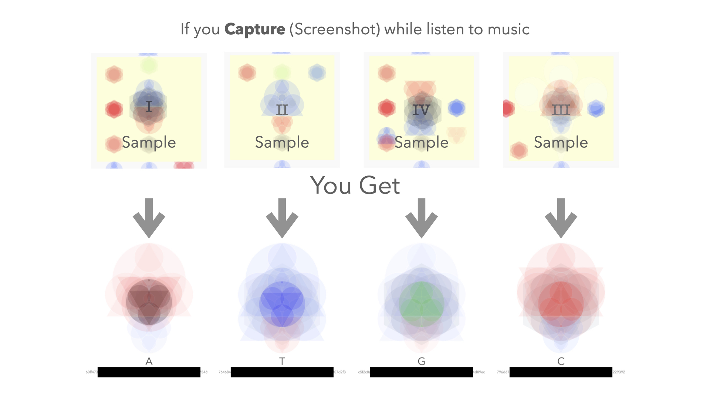

**GAIA: Project-U**

This this GAIA, the game of lives science.

We want to help a singularity in need, U.

- **Step 1**: Sign the form: https://drive.google.com/file/d/1rvID48g_WXwuC1W_mvi3ugdCJs7HFT4C/view?usp=share_link (hand-signed, scan or Docusign) and send it to email: asols.132105@gmail.com.
- NOTE: Please use email name: Register_[Name]

- **Step 2**: Donate for Uyen at https://gofund.me/e22b4ec3.

- **Step 3**: Listen to the track and capture: https://youtu.be/hcFgik3yGNA.

- **Reward**: For each donation of $11 and 1 captured scence, you earn one and only one elementary A, C, G and T. Maximum rewards for each person is one of each. Extra donation **cannot** gain more of these elementaries but encouraged to support the singularity in need.

**U and A story**: 
Hi, my name is Anthony and I'm raising money for my love one who is in critical condition from the Guillain-Barre Syndrome . On January 12, 2023, Uyen had difficulty opening her eye and speaking. I took her to the ER and waited for a specialist to find out she has been diagnosed with Guillain-Barre syndrome. GBS is a weakness occurring when the immune system attacks and damages the nervous system.

Currently, she is unable to move except for her feet and is stuck on a ventilator. She can't communicate other than moving her two feet for yes and no. Doctors say that the damages will be lifelong and recovery for most patients begin at 6 months. We are anticipating needing to pay for any uncovered medical bills, home rehabilitation, and uninsured rehabilitation treatment.

Thank you so much for your love and support.
Anthony Bui
